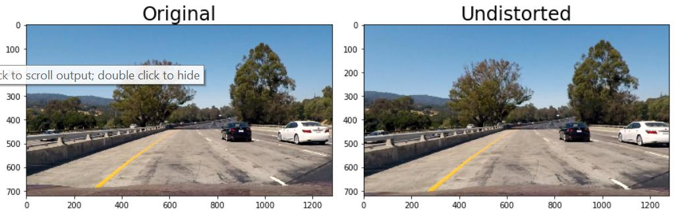
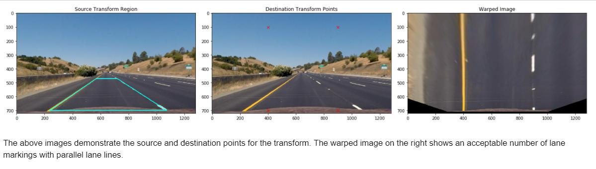
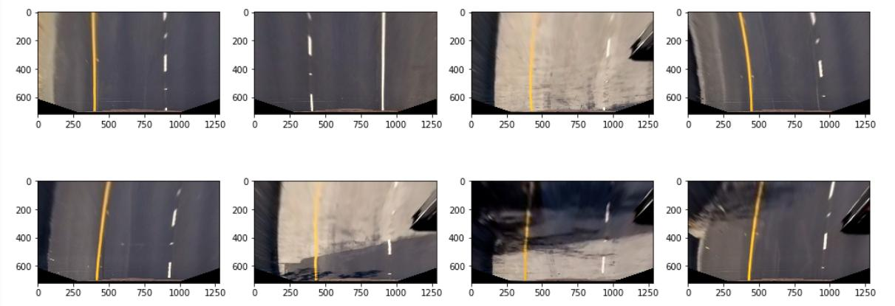

# Udacity Self Driving Car Nanodegree
# Advanced Lane Lines Project Writeup
### Brian Fischer

**Advanced Lane Lines Detection Project Overview**

Example Image:

The goals / steps of this project are the following:
1. Camera Calibration
2. Perspective Transform
3. Thresholded Binary Image
4. Detect Lane Lines
5. Determine Lane Curvature
6. Reproject Lane Boundaries
7. Overlay Calculations

------
# Rubric Points
------

Here I will consider the rubric points individually and describe how I addressed
each point in my implementation.

-------------------
## 1) Writeup / README

**Provide a Writeup / README that includes all the rubric points and how you
addressed each one.**

You're reading it! Details of the project can be found in the Jupyter notebook

## 2) Camera Calibration
**Briefly state how you computed the camera matrix and distortion coefficients. Provide an example of a distortion corrected calibration image**

A total of 16 calibration images were provided with a height of 720 pixels and width of 1280 pixels. It was observed some of the calibration images are missing corners.  These were excluded from the calibration set since it is better to have more corners than additional images of poor quality.

The calibration images of good quality were used with the cv2.findChessboardCorners function to obtain the corner coordinates (imgpoints).  In addition, object points (grid coordinates) were generated using the numpy library.

The camera matrix and distoration coefficients were calculated using the cv2.calibrateCamera along with the above two items (image points, object points).  These properties were saved in a pickled file on disk.

The cv2.undistort function then used this information to provide an undistorted sample image as shown below:

## 3) Image Processing Pipeline

### 3a) Distortion Correction
**Provide an example of a distortion-corrected image.**
Using the method described in section 2 above, below is an example of an undistorted front camera image:

It is most readily observed the hood of the car is mostly removed in the undisorted images. In addition, some of the information on the edge of the images is removed in the undistorted image which slightly reduces the field of view.

### 3b) Thresholded Binary Image
**Describe how (and identify where in your code) you used color transforms, gradients or other methods to create a thresholded binary image. Provide an example of a binary image result.**

### 3c) Perspective Transform
**Describe how (and identify where in your code) you performed a perspective transform and provide an example of a transformed image.**
Section 2 of the jupyter notebook peforms the perspective transform to a birds eye view.
A selection of points was made manually with some tools to zoom in on the image and create the quadrilateral source from a straight lane.  This was then projected for a reasonable amount of road surface into a "bird's eye view".  This top-down view will allow us to calculate the lane curvature and lane lines.

The above images demonstrate the source and destination points for the transform.  The warped image on the right shows an acceptable number of lane markings with parallel lane lines.

Below are all of the test images from a bird's eye view:

### 3d) Detect Lane Lines
**Describe how (and identify where in your code) you identified lane-line pixels and fit their positions with a polynomial?**

### 3e) Determine Lane Curvature
**Describe how (and identify where in your code) you calculated the radius of curvature of the lane and the position of the vehicle with respect to center.**

### 3f) Reproject Lane Boundaries
**Provide an example image of your result plotted back down onto the road such that the lane area is identified clearly.**

## 4) Video Pipeline
**Provide a link to your final video output. Your pipeline should perform reasonably well on the entire project video (wobbly lines are ok but no catastrophic failures that would cause the car to drive off the road!)**

## 5) Discussion
**Briefly discuss any problems / issues you faced in your implementation of this project. Where will your pipeline likely fail? What could you do to make it more robust?**